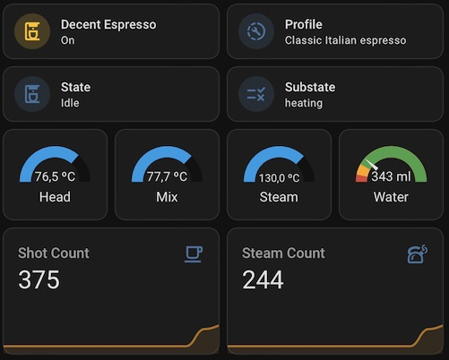

# Home Assistant Example Configuration

This directory contains an example configuration for how you can integrate the Rest API with Home Assistant.

## Configuration

The file [`rest-sensor-switch.yaml`](rest-sensor-switch.yaml) contains the a REST sensor / switch configuration that you can add
to your Home Assistant's `configuration.yaml` file (you need to restart HA for the changes to be picked up).
Make sure to replace the two occurances of `<YOUR-DECENT-TABLET-IP>` with the IP address of your Decent Machine's Tablet.

## Dasboard

An example dashboard (lovelace) card stack can be found in [`decent-card.yaml`](decent-card.yaml).
To use it do the following:
- Go into edit mode on your dashboard
- Click "Add Card"
- Select "Manual" (at the bottom)
- Paste the code from the file

